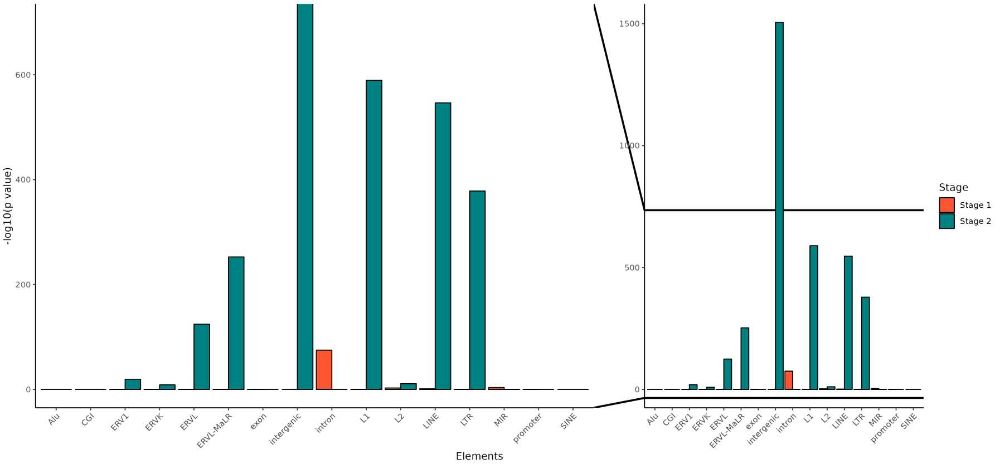
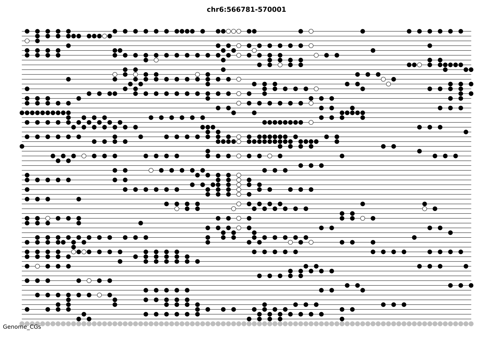
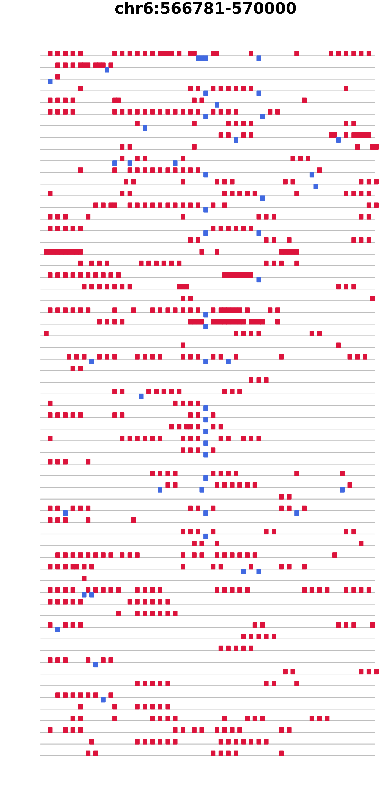
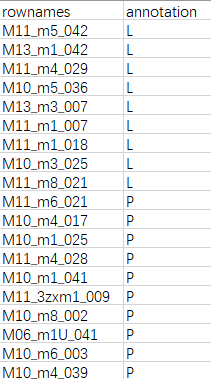
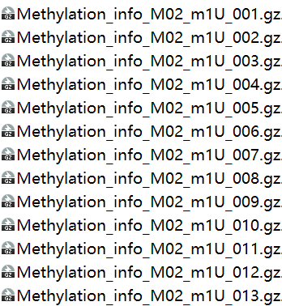
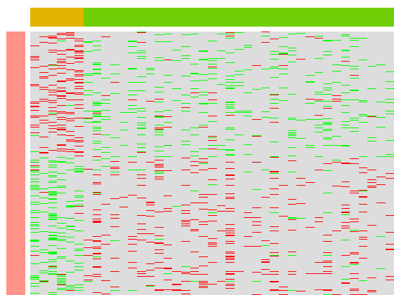

# CscMeth - Guided Analysing Tutorial

#### Compiled: June 13, 2023 			By Yuan Zhen

# Prepare ALLC files for analysis
In this tutorial, we will walk through the analysis of methylation data from two different cells - a normal cell and a colorectal cancer cell.

Specifically, we will be using the files `CRC04_NC_302.sort.rmdup.bam` and `CRC04_PT1_589.sort.rmdup.bam`. These files will be transformed into ALLC format, which is a tab-separated format consisting of seven columns that store various types of information related to DNA methylation:

| index | column name | example | note |
| --- | --- | --- | --- |
| 1 | chromosome | chr12 | The same as genome FASTA |
| 2 | position | 18283342 | 1-based |
| 3 | strand | + | either + or - |
| 4 | sequence context | CGT | can be more than 3 bases, used to determine mC type |
| 5 | mc | 1 | count of reads supporting methylation |
| 6 | cov | 2 | read coverage, cov >= mc |
| 7 | methylated | 1 | indicator of significant methylation (1 if no test is performed) |

To transform our BAM files into the ALLC format, we will use the `cscmeth bam2allc`. We can omit patient information for convenience during the conversion process. 
```
cscmeth bam2allc --bam_path ../4.0_40-bam/CRC04_NC_302.sort.rmdup.bam \
--reference_fasta /data/yuanzhen/database/0.Genome/hg19/hg19.fa \
--output_path NC_302

cscmeth bam2allc --bam_path ../4.0_40-bam/CRC04_PT1_589.sort.rmdup.bam \
--reference_fasta /data/yuanzhen/database/0.Genome/hg19/hg19.fa \
--output_path PT_589

###After this, we have four new generated files, two index files and two ALLC files:
PT_589.gz.tbi
PT_589.gz
NC_302.gz.tbi
NC_302.gz
```
# Standard pre-processing workflow
## merge
It's true that in many cases, methylation data will be generated from multiple single cells belonging to the same type, and it will be necessary to merge these cells for later analysis. This is typically done using the `cscmeth merge` command, which can be used to merge multiple ALLC files into a single file. 

However, since we are only working with two cells in this tutorial, we can skip the merging step for now. Instead, we can proceed directly to analyzing the methylation patterns of the normal and cancer cells using the ALLC files we generated earlier.
## extract
Let's assume we are only interested in CpG sites, i.e., cytosines within the context of an NCG sequence. Then we can use `cscmeth extract` to do extraction job.
```
cscmeth extract --allc_path NC_302.gz \
--output_prefix NC_302 \
--mc_contexts CGN \
--chrom_size hg19

extract --allc_path PT_589.gz  \
--output_prefix PT_589 \
--mc_contexts CGN \
--chrom_size hg19

###And we will have two ALLC files merely with cytosines under CGN context. 
PT_589.CGN-Both.allc.tsv.gz.tbi
PT_589.CGN-Both.allc.tsv.gz
NC_302.CGN-Both.allc.tsv.gz.tbi
NC_302.CGN-Both.allc.tsv.gz
```
## intersect
To ensure that we are only analyzing common CpG sites between our normal and cancer cells, we need to perform an intersection operation. Once we have obtained this set of common CpG sites, we can proceed with downstream analysis, such as calculating the methylation level, identifying differentially methylated regions, visualizing the results and so on.
```
cscmeth intersect-allc --allc_file1 NC_302.CGN-Both.allc.tsv.gz \
--allc_file2 PT_589.CGN-Both.allc.tsv.gz \
--prefix_file1 NC_302 \
--prefix_file2 PT_589

###And we have these two files:
PT_589_intersected.gz
NC_302_intersected.gz
```
Above are the necessary pre-processing steps to prepare intersected ALLC files for analysis.

# DMR analysis (premise for enrichment analysis)
For the subsequent analysis of differentially methylated regions and enrichment of genomic elements, we will use a window-based calculation method. In this method, cytosines are grouped into fixed and continuous windows, and paired t-tests are performed on the methylation values of cytosines within each window.
## window
```
cscmeth window --allc_files 302_intersected.gz 589_intersected.gz \
--step 500 \
--genome_size hg19
```
During this process, a directory will be created to store the windowing information. 
In this example, the directory is named "500_step_splitted_results" containing two files:
`Methylation_info_302_intersected.gz` and 
`Methylation_info_589_intersected.gz`
## perform test
This step is likely to be the most time-consuming throughout the entire workflow. Once it is completed, you will see four files generated, consisting of two bed files for future enrichment analysis, as well as two test results for both the background and customized filtered differentially methylated regions (DMRs):
```
cscmeth test --input1 Methylation_info_302_intersected.gz \
--input2 Methylation_info_589_intersected.gz \
--prefix NC_302-PT_589


NC_302-PT_589_DMRs-Input.bed
NC_302-PT_589_DMRs.gz
NC_302-PT_589_Tested.gz
``` 
# Enrichment analysis
## annotate
To identify which genomic elements are enriched in the DMRs, we can use the command `cscmeth annotate` annotate the DMRs and visualize the enrichment results. However, it's important to note that for this analysis, we should use the _Tested_ file as the input instead of another _DMRs_ file, as the calculation is based on the hypergeometric distribution.

To annotate the DMRs with genomic elements, there are pre-defined and aviailable files in this package. For example, in the hg19 version annotation database, the following genomic elements are included:
```
hg19.Alu_raw_4col_sorted.bed
hg19.ERVL-MaLR_raw_4col_sorted.bed
hg19.LINE_raw_4col_sorted.bed
hg19.LTR_raw_4col_sorted.bed
hg19.MIR_raw_4col_sorted.bed
hg19.promoter_raw_4col_sorted.bed
hg19.SINE_raw_4col_sorted.bed
```
This step also creates a special directory 302vs589_Tested_annotation to store its annotaion results for calcaulating p-values and plotting.
```
### If there is only one element after --elements, then quotation mark won't be necessary.

cscmeth annotate --tested_file NC_302-PT_589_Tested.gz \
--elements 'Alu SINE LINE' \
--anno_dir hg19

### command `ls` results
NC_302-PT_589_Tested.gz_Alu
NC_302-PT_589_Tested.gz_LINE
NC_302-PT_589_Tested.gz_SINE
```
## region2gene
Input DMRs.bed file generated in the [test] step to associate input regions 
with nearby genes. 
```
cscmeth region2gene --dmr NC_302-PT_589_DMRs-Input.bed --genome hg19
```
This steps generates two .csv files, a simple one: 
columA means which input is hypermethylated and column B refers to the genes whose genebody and promotor regions are matched.

| A      | B         |
|--------|-----------|
| input1 | ANKRD30BL |
| input1 | EIF5B     |
| input1 | GALNT2    |
| input2 | GLIS3     |
| input2 | GPD2      |
| input2 | KCNIP2    |
and a complicated one:

| chr   | start    | end      | input  | count | chr   | start    | end      | gene                |
| ----- | -------- | -------- | ------ | ----- | ----- | -------- | -------- | ------------------- |
| chr1  | 2055501  | 2056000  | input1 | 2     | chr1  | 1981849  | 2116834  | PRKCZ_genebody      |
| chr1  | 150997001| 150997500| input2 | 2     | chr1  | 150980866| 151008189| PRUNE1_genebody     |
| chr1  | 230257001| 230257500| input1 | 2     | chr1  | 230193535| 230417876| GALNT2_genebody      |
| chr2  | 38709501 | 38710000 | input1 | 2     | chr2  | 38685779 | 38742882 | LINC02613_genebody  |
| chr2  | 68479501 | 68480000 | input2 | 1     | chr2  | 68479164 | 68480664 | PPP3R1_promoter     |
| chr2  | 68479501 | 68479664 | input2 | 2     | chr2  | 68405988 | 68479664 | PPP3R1_genebody     |

# Pictures
There are currently five plot functions in CscMeth:
<br />`cscmeth tanghulu`, suitable for visualizing methylation data in short range.<br />`cscmeth minihg`, suitable for visualizing methylation data in long range.
## dmr-elements
Simply specify the _directory_ and the _tested file_ created during [annotation] step:
```
cscmeth dmr-elements --tested_file NC_302-PT_589_Tested.gz \
--anno_dir 302vs589_Tested_annotation
```
This will generate three new files: 
* one including original numbers for calculation 
* one containing calculation results of all specified elements 
* a plot

However, since we are only using two cells as input, the results may not be significant. Therefore for the purpose of illustration, the following image shows an example of the enrichment results:

# tanghulu
Please note here what follows --allc_path is **a directory where ALLC files to be ploted are**. And This step may take a while if there are many ALLC files.
```
cscmeth tanghulu --allc_path ../../allcools/0.plot/ \
--range chr6:566781-570000\
```

# minihg
`minihg` is similar to `tanghulu` function, but the main difference is that the former one is more suitable for a short range while the latter one can handle a wide range.
```commandline
cscmeth minihg --allc_path ../../allcools/0.plot/ \ 
--range chr6:566781-570000
```

# heatmap
`heatmap` is to demonstrate DMRs of single cell ALLC files, and it requires at least three arguments:
* a table file(metadata), such as a `.csv`or`.txt` file with rownames being keywords for matching ALLC files or exactly ALLC file names and one column called `annotation` providing group information.
<br />For example:
<br />
<br />So for each rowname in the metadata, it looks for the only matching one in the directory specified in the next argument.
* a directory containing windowing results of **single cells**. To generate corresponding files, just use `window` function and remember to change the `mode` parameter to "single" 
* bed file(s separated by space) generated in the [test] step
```commandline
cscmeth heatmap --metadata ../2023-04-27_MetaData.csv \
--dir_path 500_step_windowed_results  \
--bed DMR-L2P_DMRs-Input.bed DMR-P2D_DMRs-Input.bed DMR-D2MI_DMRs-Input.bed
```
In the picture below, row annotation refers to the first input dmr, each row being a dmr region, and column annotation means group information, i.e., the annotation column in the metadata.
<br />
# global-elements
To be continued...
